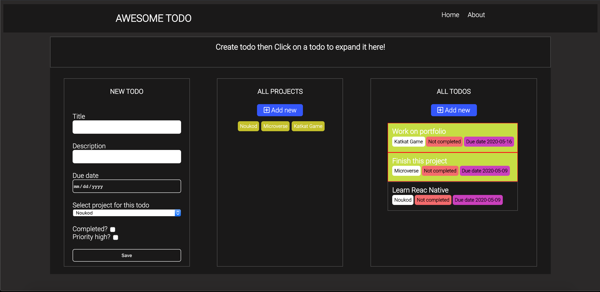

<h1 align="center">
  <br>
    Awesome To-Do
  <br>
</h1>
<h4 align="center">A simple to-do list project to store your to-do list. You can create edit and delete to-do set priority for the to-do and set their status to completed or not completed, You can group your to-do by project. You can only create a project and display a to-do that belongs to this project. To-do are saved in the browser session storage and project are stored in localStorage.</h4>


</br>
<p align="center">
  <a href="#key-features">Key Features</a> •
  <a href="#how-to-use">How To Use</a> •
  <a href="#credits">Credits</a> •
  <a href="#related">Related</a> •
  <a href="#license">License</a>
</p
    
<p align="center">
    
</p>

## Live version

https://tashfeenrao.github.io/todo-js/

## Key Features

* Create todo
* Delete todo
* edit todo 
* set todo priority 
* Set todo status to complete or not completed
* group todo by project
* Display todo by project name


## Related
* Html
* CSS (Bootstrap)
* JavaScript


## External library 

* Webpack
* css-loader
* file-loader


## How To Use
Clone this repo (you need Node js installed in your computer).
```
$ git clone git@github.com:certilremy/todo-js.git
```

 Change to the app directory 
 
 ```
$ cd todo-js
 ```

   And run 

```
$ npm install 
```

To start the server you don't need other special server you can go to the project folder ans click the index.html or install live server extention if you're using vsCode

## Authors

* Certil Remy    Github : https://github.com/certilremy
* Tashfeen Rao   Github : https://github.com/TashfeenRao
## Credits

This software uses the following open source packages:

- [React](https://React.org/)
- [Node.js](https://nodejs.org/)
- [Webpack](https://webpack.js.org/)
- [Babel](https://babeljs.io/)
- [Jest](https://jestjs.io/)
- [Microverse](http://microverse.org/)
- [Odin Project](https://www.theodinproject.com/)

## License

MIT

---
Portfolio [Tashfeen Rao](https://tashfeen-rao.netlify.app/) &nbsp;&middot;&nbsp;
</br>
Email: tashfeendev@gmail.com &nbsp;&middot;&nbsp;
</br>
AngelList [TashfeenRao](https://angel.co/u/tashfeen-rao) &nbsp;&middot;&nbsp;
</br>
LinkedIn [Tashfeen Rao](https://www.linkedin.com/in/tashfeen-rao/) &nbsp;&middot;&nbsp;
</br>
Twitter [@TashfeenDev](https://twitter.com/TashfeenDev) &nbsp;&middot;&nbsp;
